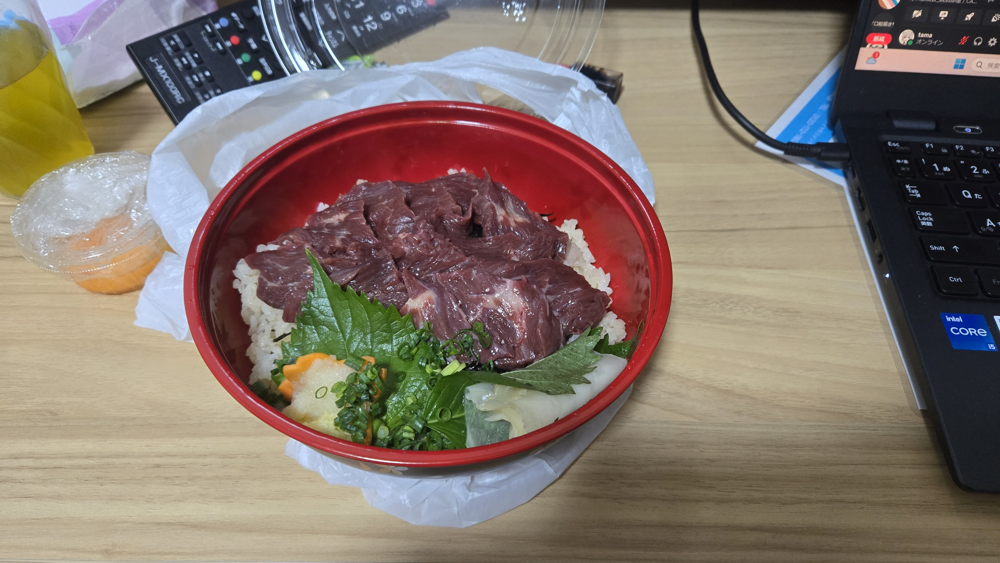

+++
title = 'CyberAgentさんのインターンに参加しました'
description = 'CyberAgentのゲームエンジニア向けインターン「プロトスプリントリーグ」に参加した体験記です。'
summary = "CyberAgentのゲームエンジニア向けインターン「プロトスプリントリーグ」に参加した体験記です。" # For the post in lists.
date = '2024-09-21'
aliases = ["hugo-page-bundles"]
author = 'laTH380'
usePageBundles = true

featureImage = 'samune.png' # Top image on post.
# featureImageAlt = 'Description of image' # Alternative text for featured image.
# featureImageCap = 'This is the featured image.' # Caption (optional).
thumbnail = 'samune.png' # Image in lists of posts.
# shareImage = 'share.jpg' # メディアに共有されるときに選択される画像

categories = [
    "就活"
]
tags = [
    "インターン","CyberAgent"
]

draft = false #非表示になる
featured = true #おすすめに表示される
toc = true #目次が表示される
abstract = "aaaaaaaaaaaaaaaaaaaaaaaaaa"
comments = false
+++

## はじめに
CyberAgentさんのゲームエンジニア向けインターン「プロトスプリントリーグ」（通称プロト）に参加してきました。

その刺激的な体験を忘れないように記録しておきます。

## 選考
書類選考と面接が二回でした。
面接は一回目がエンジニアさんとの面接、二回目が人事さん。
一回目は書類選考に乗せた自分の作品についてや、学んでいる、使っているプログラミング技術についてお話。

二回目はキャリアビジョン等、とはいえ担当の人事の方が元エンジニアの方で技術に関係するお話もすることができました。

## インターン内容
### 概要
プロトは三日間オンライン形式で行われました。本来はアベマタワーに集まって開催の予定でしたがあいにくのツヨツヨ台風のおかげで変更になりました...残念！！

内容はいたってシンプル、お題に沿ったゲームをチームで開発する、ゲーム制作ハッカソン形式です。

各チーム4人、そして担当のメンターさんが二人もついてくださいました。

テーマは「ためる」

シンプルかついくらでもアイデアが浮かんできますね..!

### 準備期間
三日間といいましたがキックオフ会は一週間前に行われました。そこでチーム分けとテーマ発表もあり、当日までの一週間は準備期間となっていました。

準備期間はコードを書く以外のことはやってもおっけー！私たちのチームでは企画決めとクラス設計、アセットの用意を行いました。

### 本番三日間
朝10時にオンラインで全体会を行い、プロトスタート！

事前に決めたクラス設計をもとにひたすらにコードを書く期間に突入です。チームで通話を繋ぎながら黙々と作業を進めていました。

集中してコード書いてるとあっという間に夜になりますよね。

夜には毎日懇親会が行われました。メンターの社員さんであったりほかのチームメンバーであったり。夕食代も出してもらえたのでちょっと珍しいものを食べたり...

参加しているインターン生はみな能力も意識も高い人ばっかり。社員さんはもちろんプロですから、どの方からも学びになるお話をたくさん聞けて楽しかったです。

意見の衝突などもありつつ制作は順調に進み、二日目の夜はとても遅くまで作業したりで三日目の締切2分前、無事ビルド済みデータを提出することができました。

ぶっつけビルドを自分が担当していたので提出完了までもう気が気でなくて半パニックでしたね...

みんなは一回ビルドデータを完成させてからぎりぎりまでブラッシュアップするようにしようね！

最後に表彰会とラスト懇親会。

私たちのチームは残念ながら優勝を逃してしまいました。とても悔しい。

最後の懇親会はチーム関係なくトークテーマごとに集まって色々はお話ができました。就活だったりキャリアビジョンだったりゲームのことだったり...etc。普段なら絶対聞けないお話とかも聞けました。

## 感想
最後に全体を通しての感想を。

「みんなすごすぎる！！！！！！」

多少はあった自分への自信を粉々に砕かれました。もちろんいい意味で。

すでにものすごい作品を制作している人、実装力が桁違いな人、チーム運営力に舌を巻く人、なんか三日間で素材フル自作してる人...同じ就活生という立場でこんなにも実力に差があるのかと思い知らされました。

そして、そんな方々と直接かかわりチーム制作を行うことができたことで、本当に多くのことを学ぶことができました。

そして、プロのメンターの方々から聞けた多くの話。就活や就職後のビジョンを考えるため非常に参考になることばかりでした。

まだまだ自分も努力を続けないといけないなと気が引き締まると同時に、さらに彼らを目標として今後の就活やキャリアを乗り越えていきたいです。

就活中のそこのあなた！ぜひ参加してみることをおすすめします！！

プロのみなさんから学ぶことができるのはもちろん、同じ境遇の優秀な方々とかかわることができるこのインターンは本当に貴重で大きな経験になりますよ！
