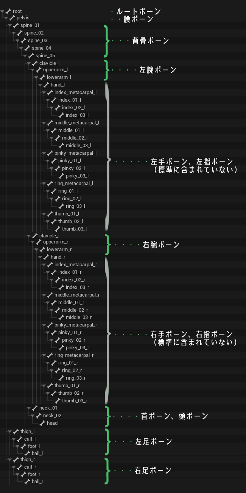
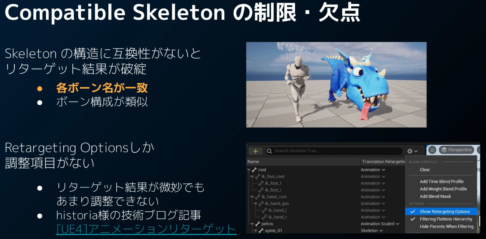
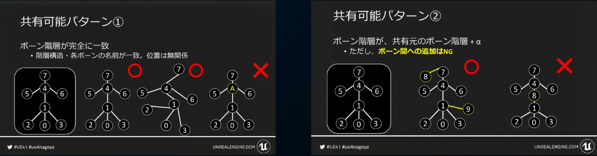
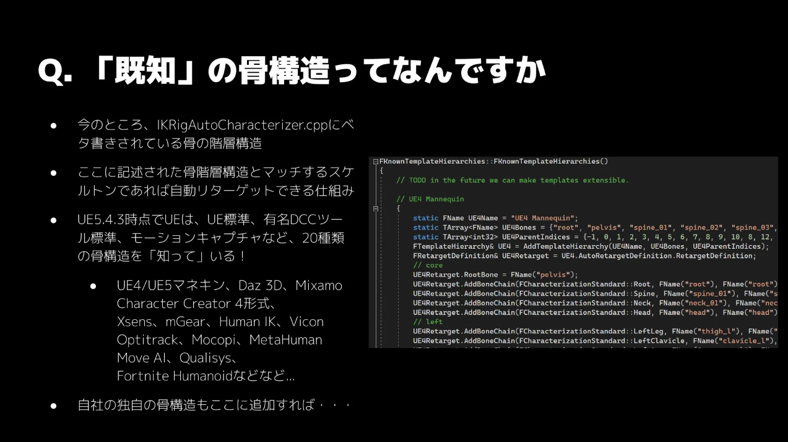

## 結論
UE5標準ボーン構造は以下の通り。

### 補足
命名規則と階層構造がそろっていればよい。特に命名規則が大事でそれさえ守られていればUE5標準と同等に扱えることも多い。

この構成を守ったうえでさらにボーンを追加する分には問題がない。

UE5テンプレートのキャラクターモデルはこの構造に、手指はもちろん、ひねりをコントロールするボーンなどいくつかのボーンが追加されています。標準ボーン構造の拡張の参考になります。
## はじめに
UE5の標準ボーン構造、つまりはテンプレートにいる銀色のキャラクターのボーン構造を調べてまとめました。

人型のキャラクターをUEで用いる場合はこのボーン構造に準拠しておくのが非常におすすめです。アセットのアニメーションがそのまま使いまわせたり、アニメーションにかかわる便利な機能がつかえたり...など利点しかありません。

ぜひ参考にしてください！

ここからは、この情報の調査方法を記述して信憑度を上げておきます。
## 調査方法
公式がまとめてくれてないかな、とひたすら情報を探し求めていた時。みつけました。

なんとエンジンのプログラムに直接書き込まれているだと！？

該当部分を見に行くと以下の通りでした。ということで解決です。

前述したとおり、この構造において重要なのは階層構造と命名規則です。特に名前を元にして駆動するUE標準用機能が多いため、最悪名前させ一致させておけば少しの手直しでUE標準と同等に扱えるはずです(責任は負いません)。

// UE5 Mannequin
{
	static FName UE5Name = "UE5 Mannequin";
	static TArray<FName> UE5Bones = {"root", "pelvis", "spine_01", "spine_02", "spine_03", "spine_04", "spine_05", "neck_01", "neck_02", "head", "clavicle_l", "upperarm_l", "lowerarm_l", "hand_l", "index_metacarpal_l", "index_01_l", "index_02_l", "index_03_l", "middle_metacarpal_l", "middle_01_l", "middle_02_l", "middle_03_l", "thumb_01_l", "thumb_02_l", "thumb_03_l", "pinky_metacarpal_l", "pinky_01_l", "pinky_02_l", "pinky_03_l", "ring_metacarpal_l", "ring_01_l", "ring_02_l", "ring_03_l", "clavicle_r", "upperarm_r", "lowerarm_r", "hand_r", "pinky_metacarpal_r", "pinky_01_r", "pinky_02_r", "pinky_03_r", "ring_metacarpal_r", "ring_01_r", "ring_02_r", "ring_03_r", "middle_metacarpal_r", "middle_01_r", "middle_02_r", "middle_03_r", "index_metacarpal_r", "index_01_r", "index_02_r", "index_03_r", "thumb_01_r", "thumb_02_r", "thumb_03_r", "thigh_r", "calf_r", "foot_r", "ball_r", "thigh_l", "calf_l", "foot_l", "ball_l"};
	static TArray<int32> UE5ParentIndices = {-1, 0, 1, 2, 3, 4, 5, 6, 7, 8, 6, 10, 11, 12, 13, 14, 15, 16, 13, 18, 19, 20, 13, 22, 23, 13, 25, 26, 27, 13, 29, 30, 31, 6, 33, 34, 35, 36, 37, 38, 39, 36, 41, 42, 43, 36, 45, 46, 47, 36, 49, 50, 51, 36, 53, 54, 1, 56, 57, 58, 1, 60, 61, 62};
	FTemplateHierarchy& UE5 = AddTemplateHierarchy(UE5Name, UE5Bones, UE5ParentIndices); 
	FRetargetDefinition& UE5Retarget = UE5.AutoRetargetDefinition.RetargetDefinition;
	// core
	UE5Retarget.RootBone = FName("pelvis");
	UE5Retarget.AddBoneChain(FCharacterizationStandard::Root, FName("root"), FName("root"));
	UE5Retarget.AddBoneChain(FCharacterizationStandard::Spine, FName("spine_01"), FName("spine_02"));
	UE5Retarget.AddBoneChain(FCharacterizationStandard::Neck, FName("neck_01"), FName("neck_02"));
	UE5Retarget.AddBoneChain(FCharacterizationStandard::Head, FName("head"), FName("head"));
	// left
	UE5Retarget.AddBoneChain(FCharacterizationStandard::LeftLeg, FName("thigh_l"), FName("ball_l"),FCharacterizationStandard::LeftFootIKGoal);
	UE5Retarget.AddBoneChain(FCharacterizationStandard::LeftClavicle, FName("clavicle_l"), FName("clavicle_l"));
	UE5Retarget.AddBoneChain(FCharacterizationStandard::LeftArm, FName("upperarm_l"), FName("hand_l"),FCharacterizationStandard::LeftHandIKGoal);
	UE5Retarget.AddBoneChain(FCharacterizationStandard::LeftIndexMetacarpal, FName("index_metacarpal_l"), FName("index_metacarpal_l"));
	UE5Retarget.AddBoneChain(FCharacterizationStandard::LeftMiddleMetacarpal, FName("middle_metacarpal_l"), FName("middle_metacarpal_l"));
	UE5Retarget.AddBoneChain(FCharacterizationStandard::LeftRingMetacarpal, FName("ring_metacarpal_l"), FName("ring_metacarpal_l"));
	UE5Retarget.AddBoneChain(FCharacterizationStandard::LeftPinkyMetacarpal, FName("pinky_metacarpal_l"), FName("pinky_metacarpal_l"));
	UE5Retarget.AddBoneChain(FCharacterizationStandard::LeftThumb, FName("thumb_01_l"), FName("thumb_03_l"));
	UE5Retarget.AddBoneChain(FCharacterizationStandard::LeftIndex, FName("index_01_l"), FName("index_03_l"));
	UE5Retarget.AddBoneChain(FCharacterizationStandard::LeftMiddle, FName("middle_01_l"), FName("middle_03_l"));
	UE5Retarget.AddBoneChain(FCharacterizationStandard::LeftRing, FName("ring_01_l"), FName("ring_03_l"));
	UE5Retarget.AddBoneChain(FCharacterizationStandard::LeftPinky, FName("pinky_01_l"), FName("pinky_03_l"));
	// right
	UE5Retarget.AddBoneChain(FCharacterizationStandard::RightLeg, FName("thigh_r"), FName("ball_r"),FCharacterizationStandard::RightFootIKGoal);
	UE5Retarget.AddBoneChain(FCharacterizationStandard::RightClavicle, FName("clavicle_r"), FName("clavicle_r"));
	UE5Retarget.AddBoneChain(FCharacterizationStandard::RightArm, FName("upperarm_r"), FName("hand_r"),FCharacterizationStandard::RightHandIKGoal);
	UE5Retarget.AddBoneChain(FCharacterizationStandard::RightIndexMetacarpal, FName("index_metacarpal_r"), FName("index_metacarpal_r"));
	UE5Retarget.AddBoneChain(FCharacterizationStandard::RightMiddleMetacarpal, FName("middle_metacarpal_r"), FName("middle_metacarpal_r"));
	UE5Retarget.AddBoneChain(FCharacterizationStandard::RightRingMetacarpal, FName("ring_metacarpal_r"), FName("ring_metacarpal_r"));
	UE5Retarget.AddBoneChain(FCharacterizationStandard::RightPinkyMetacarpal, FName("pinky_metacarpal_r"), FName("pinky_metacarpal_r"));
	UE5Retarget.AddBoneChain(FCharacterizationStandard::RightThumb, FName("thumb_01_r"), FName("thumb_03_r"));
	UE5Retarget.AddBoneChain(FCharacterizationStandard::RightIndex, FName("index_01_r"), FName("index_03_r"));
	UE5Retarget.AddBoneChain(FCharacterizationStandard::RightMiddle, FName("middle_01_r"), FName("middle_03_r"));
	UE5Retarget.AddBoneChain(FCharacterizationStandard::RightRing, FName("ring_01_r"), FName("ring_03_r"));
	UE5Retarget.AddBoneChain(FCharacterizationStandard::RightPinky, FName("pinky_01_r"), FName("pinky_03_r"));
	// bone settings for IK
	UE5.AutoRetargetDefinition.BoneSettingsForIK.SetRotationStiffness(FName("pelvis"), FCharacterizationStandard::PelvisRotationStiffness);
	UE5.AutoRetargetDefinition.BoneSettingsForIK.SetRotationStiffness(FName("clavicle_l"), FCharacterizationStandard::ClavicleRotationStiffness);
	UE5.AutoRetargetDefinition.BoneSettingsForIK.SetRotationStiffness(FName("clavicle_r"), FCharacterizationStandard::ClavicleRotationStiffness);
	UE5.AutoRetargetDefinition.BoneSettingsForIK.SetRotationStiffness(FName("foot_l"), FCharacterizationStandard::FootRotationStiffness);
	UE5.AutoRetargetDefinition.BoneSettingsForIK.SetRotationStiffness(FName("foot_r"), FCharacterizationStandard::FootRotationStiffness);
	UE5.AutoRetargetDefinition.BoneSettingsForIK.SetPreferredAxis(FName("calf_l"), EPreferredAxis::PositiveZ);
	UE5.AutoRetargetDefinition.BoneSettingsForIK.SetPreferredAxis(FName("calf_r"), EPreferredAxis::PositiveZ);
	UE5.AutoRetargetDefinition.BoneSettingsForIK.SetPreferredAxis(FName("lowerarm_l"), EPreferredAxis::PositiveZ);
	UE5.AutoRetargetDefinition.BoneSettingsForIK.SetPreferredAxis(FName("lowerarm_r"), EPreferredAxis::PositiveZ);
	UE5.AutoRetargetDefinition.BoneSettingsForIK.SetExcluded(FName("spine_05"), true);
	// unreal ik bones
	UE5.AutoRetargetDefinition.BonesToPin.AddBoneToPin("ik_foot_root", "root");
	UE5.AutoRetargetDefinition.BonesToPin.AddBoneToPin("ik_foot_l", "foot_l");
	UE5.AutoRetargetDefinition.BonesToPin.AddBoneToPin("ik_foot_r", "foot_r");
	UE5.AutoRetargetDefinition.BonesToPin.AddBoneToPin("ik_hand_root", "root");
	UE5.AutoRetargetDefinition.BonesToPin.AddBoneToPin("ik_hand_gun", "hand_r");
	UE5.AutoRetargetDefinition.BonesToPin.AddBoneToPin("ik_hand_l", "hand_l");
	UE5.AutoRetargetDefinition.BonesToPin.AddBoneToPin("ik_hand_r", "hand_r");
	// exclude feet from auto-pose
	UE5.AutoRetargetDefinition.BonesToExcludeFromAutoPose.Add("foot_l");
	UE5.AutoRetargetDefinition.BonesToExcludeFromAutoPose.Add("foot_r");
}

## おわりに
あきらかに存在する、というか知っていることを前提として利用できる機能も多々あるのに「UE5標準のボーン構造はこれ！」という記事が一つも引っ掛かりません。

これは由々しき事態ですよ！

ということでまとめておきました。実物を見に行けばいいって、それは初心者には酷だよ～

UE公式はぜひ日本語で標準ボーン構造についてまとめてくれるとうれしいなぁ
## 参考資料
- [UE5でのアニメーションの流用方法について【Compatible Skeletons, IK Retargeter】](https://www.docswell.com/s/EpicGamesJapan/KQN3EK-UE5-ShareAnimation)
- [Unreal Engine 5.4、あの新機能を追え！](https://www.docswell.com/s/EpicGamesJapan/KQR34N-ue-meetup-osaka-02)