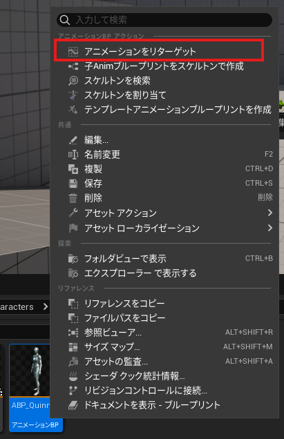
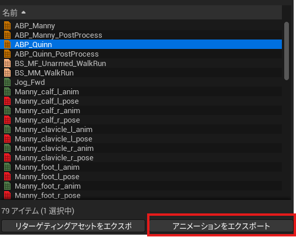
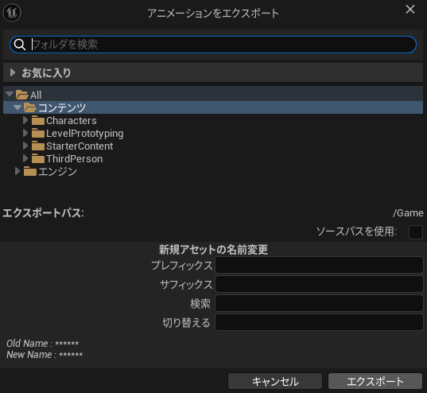
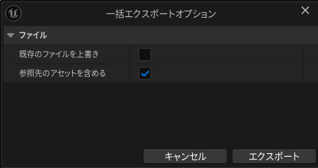

# 進化したアニメーションリターゲット（旧IKリターゲッター）
すごく便利に進化していました。備忘録もかねて使い方を紹介します。

参考にしたのは以下のスライドです。ほかにもいくつかの新機能が紹介されているので一読をお勧めします！

> 参考元：[Unreal Engine 5.4、あの新機能を追え！](https://www.docswell.com/s/EpicGamesJapan/KQR34N-ue-meetup-osaka-02#p49)
# どう進化したの
これまではIKリターゲットを行うためにリターゲット元と先、それぞれのIKアセットとIKリターゲッターオブジェクトの三つを手作業で制作する必要がありました。

進化したアニメーションリターゲットではそれら一切作る必要がありません。リターゲット元と先を設定するだけで自動でやってくれちゃいます！
# 使い方
まずリターゲット元となるアニメーションアセットを右クリック、「アニメーションリターゲット」を選択します。

表示されるウィンドウの「ターゲット」欄にリターゲット先のスケルタルメッシュを設定します。

さらにもう一度、リターゲット元となるアニメーションを選択してからエクスポートをクリックします。

最後に、保存先や保存方法の設定を行えば完了です。リターゲットされたアニメーションアセットが生成されます！

**完成！**

# 仕組み
リターゲットの仕組み自体は以前までと変わらないようで、内部的にはIKとIKリターゲッタを作成し処理を行っているとのこと。

そのためIKリターゲットの書き出しも可能。もしリターゲットの手修正を行いたければ従来の方法で行うことが可能です。（方法は参考元）